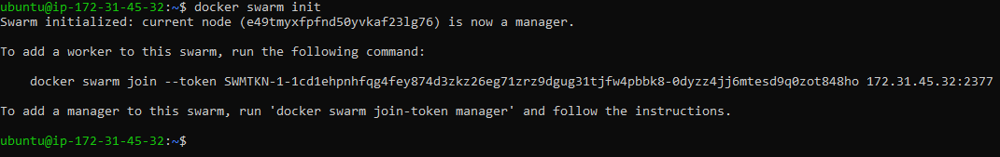
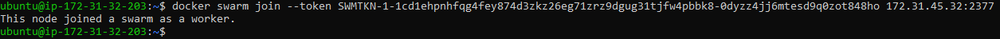
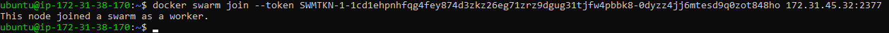
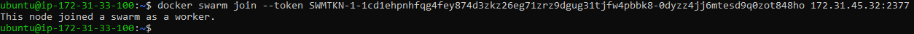
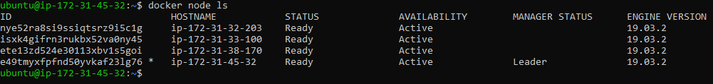
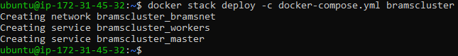
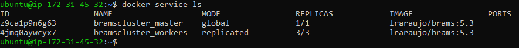
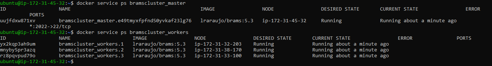
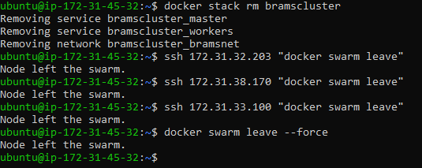

# Tutorial BRAMS em *containers*

Nesse tutorial, cobriremos tópicos acerca da execução do BRAMS em um ambiente de *containers*, incluindo a instalação do Docker, preparação do ambiente, recursos do Docker utilizados e a execução do modelo nesse ambiente, utilizando um ou múltiplos *hosts*.

## Introdução

O Docker é uma plataforma que oferece diversos recursos para organizar e executar aplicações em *containers*.

*Container* é um artíficio de virtualização, com a característica de ser um ambiente leve, devido a maneira como é virtualizado (*OS-level virtualization*). Estão sendo comumente utilizados, visto que oferecem diversas vantagens em relação a outros métodos de virtualização e em relação a utilização de aplicações de maneira local. Seus benefícios incluem isolamento, consistência, reprodutibilidade, compatibilidade, entre outros. O Docker facilita a utilização dos *containers* ao oferecer recursos para configurar, executar, distribuir e gerenciar aplicações em *containers*.

Alguns recursos oferecidos pelo Docker, e que serão utilizados nesse tutorial, são listados e referenciados abaixo:

* [Dockerfile](https://docs.docker.com/engine/reference/builder/)
* [Docker Volume](https://docs.docker.com/storage/volumes/)
* [Docker Swarm](https://docs.docker.com/engine/swarm/)
* [Docker Compose](https://docs.docker.com/compose/)

## Preparação do Ambiente

Os subtópicos de preparação do ambiente devem ser realizados previamente ao início do resto do tutorial, pois alguns passos podem levar algum tempo para serem efetuados.

### Instalação do Docker

Nesse tópico, indicaremos *links* para a instalação do Docker em ambiente Linux e Windows.

#### Linux

Abaixo, seguem os tutoriais do Docker para instalação nas principais distribuições do Linux.

* [CentOS](https://docs.docker.com/install/linux/docker-ce/centos/)
* [Debian](https://docs.docker.com/install/linux/docker-ce/debian/)
* [Fedora](https://docs.docker.com/install/linux/docker-ce/fedora/)
* [Ubuntu](https://docs.docker.com/install/linux/docker-ce/ubuntu/)

* [Post-installation steps for Linux (Opcional)](https://docs.docker.com/install/linux/linux-postinstall/)

#### Windows

Segue o tutorial do Docker para instalação no Windows:

* [Windows 10 64-bit: Pro, Enterprise, or Education](https://docs.docker.com/docker-for-windows/install/)

Para outras versões do Windows 10 ou versões mais antigas, a solução é utilizar o Docker Toolbox:

* [Docker Toolbox](https://docs.docker.com/toolbox/toolbox_install_windows/)

### Outros recursos

Antes de abordarmos os conceitos do Docker e executarmos o *container*, vamos finalizar a preparação do ambiente com o *download* de alguns recursos necessários.

#### Docker image

Baixe a imagem existente do BRAMS (versão 5.3), utilizando o comando abaixo:

```
docker pull lraraujo/brams:5.3
```

O conceito de imagem será abordado na sequência, por enquanto apenas precisamos que ela esteja disponível na máquina.

#### Caso de teste

O próximo passo é escolher um dos dois casos de teste executados até então:

* [meteo-only](http://ftp.cptec.inpe.br/brams/BRAMS/data/meteo-only.tgz)
* [meteo-chem](http://ftp.cptec.inpe.br/brams/BRAMS/data/meteo-chem.tgz)

Esse arquivo deve ser descompactado em algum local na máquina em que o Docker foi instalado. Para os testes realizados até então, os subdiretórios necessários para execução do modelo são: `datain/`, `dataout/` e `shared_datain/`. O restante dos arquivos pode ser ignorado.

Finaliza-se aqui a preparação do ambiente. Antes de iniciar o tutorial, de fato, espera-se que esses passos sejam realizados para fluir normalmente os passos que seguem.

## BRAMS em *containers*

Iniciaremos abordando como o BRAMS foi portado para a execução em *containers* e, na sequência, trataremos os dois casos de execução: *single-host* e *multi-host*. Por fim, mostraremos algumas maneiras de utilizar o *container* como um ambiente de testes para modificações na aplicação e distribuição dessas versões modificadas.

### Imagem

Nesse tópico, será explorado como é construída uma imagem, mais especificamente a imagem do BRAMS, para entender esse conceito e como ele faz parte do processo de *containerização*.

No Docker, uma imagem é um recurso composto por diversas camadas que são criadas através da execução de uma sequência de comandos. Esses comandos são dispostos em um arquivo chamado de Dockerfile, que funciona como um *template*. Nesse arquivo, são colocados comandos que construirão a imagem com todas as aplicações e dependências necessárias para executar o que se deseja, dentro de um *container*. A utilização das imagens se dá justamente através dos *containers*, que são instâncias das imagens. O intuito da imagem é criar um ambiente isolado, com aquilo que realmente é necessário para executar a aplicação dentro de um *container*.

A imagem do BRAMS foi construída utilizando o [Dockerfile](files/Dockerfile) disponibilizado no repositório. Os comandos para construção da imagem foram divididos nas subseções abaixo para uma melhor abordagem do que é realizado.

#### Imagem base

Todos os arquivos Dockerfile válidos iniciam com um comando `FROM`, que especifica qual a imagem base para a construção da imagem desejada.

#### Dependências

Na parte inicial do Dockerfile, são instaladas as dependências para execução do modelo. Entre essas dependências temos MPI, o pacote WGRIB2 e as bibliotecas NetCDF. Agora, essas aplicações se encontram isoladas nesse ambiente e também podem evitar problemas de compatibilidade, devido a versão do SO da própria imagem.

#### Configuração SSH

Esse recurso é configurado para a execução em múltiplos *hosts*, sendo descartável caso o usuário vá executar somente em um único *host*. A configuração SSH tem dois objetivos:

* Quando executa em múltiplos *hosts*, o MPI fará `ssh` do *host* principal para todos os outros.
* Ao executar em múltiplos *hosts*, faremos `ssh` para o *container* no *host* principal para então executar o *script* e distribuir a aplicação entre os *containers*.

#### BRAMS

Na sequência, realiza-se uma cópia da versão do modelo disponibilizada, ao lado dessa cópia estão os arquivos que estão sendo disponibilizados e serão utilizados. Após a cópia, o modelo é configurado, compilado e instalado.

#### Finalização

Após os passos anteriores, há a cópia de um *script* e uma breve limpeza de arquivos. Por fim, é definido o diretório de trabalho, é definido que o *container* escutará a porta 22 durante a execução (SSH, necessário apenas para *multi-host*) e o comando padrão é definido como o servidor OpenSSH, que também indica que o *container* ficará aguardando essa conexão.

### Construção

Após finalizar o Dockerfile, a imagem pode ser construída para ficar disponível localmente. O comando a ser utilizado, no diretório onde se encontra o Dockerfile, é o seguinte:

```
docker build -t <name> .
```

Após a construção da imagem, ela pode ser vista através do comando `docker images`. Informações como o tamanho da imagem também aparecerão com a utilização desse comando.

## Executando em um único host

Nesse tópico, será explorado a execução do BRAMS em um único *host*, seja local ou remoto. A execução em um único *host* utiliza um único *container*.

### Recursos

* **Docker volume**: é um mecanismo que permite manter dados entre o *host* local e os *containers*, sejam esses dados apenas para utilização como entrada para aplicação a ser executada, ou dados gerados por ela. Nos dois casos, esse recurso é útil para o BRAMS. Por um lado, parte dos dados de entrada são dependentes do caso de teste e não serão construídos juntos com o *container*. Por outro, a saída gerada pelo BRAMS já será compartilhada com um diretório no *host* local, onde a análise dos dados pode ser realizada. 

### Execução

Para executar uma imagem em um único *container*, utilizamos o comando `docker run`. Em nosso caso, ele será seguido de alguns parâmetros e o comando que será executado ao inicializar o *container*. Esse comando vai sobrepor o comando definido no Dockerfile (`sshd`, útil para o caso *multi-host*). Abaixo encontra-se o comando utilizado e os detalhes de cada parâmetro utilizado.

```
docker run --rm -v /absolute/path/to/datain:/root/bin/datain -v /absolute/path/to/dataout:/root/bin/dataout -v /absolute/path/to/shared_datain:/root/bin/shared_datain --name brams lraraujo/brams:5.3 /root/run-brams -np <number of processes> -testcase <chosen testcase> -hosts localhost:<number of processes>
```

#### Parâmetros:

* `--rm`: Comando para remover o *container* após sua execução.

* `-v <host path>:<container path>`: *Volume* para compartilhamento de dados entre *host* local e *container*.

* `--name <container-name>`: Nome do *container*.

* `<image>`: Após o nome, é selecionada a imagem.

* `<command>`: Por fim, o comando que será executado. Nesse caso, um *script* preparado para executar a aplicação através de alguns parâmetros.

#### Script de execução

Dentro do *container*, há um *script* para facilitar a execução, principalmente em execução com múltiplos *hosts*. Para o caso com um único *host* é importante definir bem os parâmetros do *script* e, para tal, vamos abrir o *script* para ver como se dá seu fluxo de execução. O arquivo se encontra em [run-brams](brams/5.3/run-brams).

### Saída

Como abordado acima, a utilização de *volumes* acarreta em compartilhamento de dados entre *host* local e *container*, nos dois sentidos. Dessa forma, os dados gerados nesses diretórios compartilhados, durante a execução, serão mantidos no *host* local.

## Executando em múltiplos hosts

Nesse tópico, será explorado a execução do BRAMS em múltiplos *hosts*. A execução em um múltiplos *hosts* utiliza mais de um *container*, dependendo da quantidade de *hosts* existentes. O lançamento dos *containers* ocorrerá de maneira automatizada, utilizando alguns recursos oferecidos pelo Docker.

### Recursos

* **Docker Swarm**: Recurso que possibilita a formação de um *cluster* composto por diversos Docker *hosts*.

* **Docker Compose**: Recurso para configurar e executar aplicações com múltiplos *containers*. Ao invés de um comando `docker run` para cada um dos *containers* a serem lançados para uma única tarefa, eles são configurados dentro de um arquivo [docker-compose.yml](files/docker-compose.yml) e lançados a partir de um único comando.

### Execução

Como essa etapa é recomendada para execução em *clusters* e esse ambiente não foi configurado para o tutorial, ela será tratada de maneira visual para servir como uma base para experimentos futuros dos usuários. Para esse exemplo, temos 4 *hosts*.

* Inicialmente, utilizaremos o Docker Swarm. Assim, escolhemos um do nós como *manager* para iniciar o *swarm*, enquanto os outros nós se conectarão ao *swarm* como *workers*. Para a execução *multi-host* do BRAMS, todos os *hosts*, seja *manager* ou *worker* desempenharão papel semelhante, o único porém é que no *manager* executaremos alguns comandos para verificar o estado do *swarm* e dos *containers*. Abaixo, o *swarm* é iniciado no *host* escolhido como *manager* e os outros três *hosts* entram no *swarm* como *workers*.






* Para conferir se todos os nós encontram-se ativos no *swarm*, basta executar o comando `docker node ls` no *host manager* e observar a saída.



* Após a verificação apresentar a saída esperada, estamos prontos para distribuir os *containers* pelos *hosts* membros do *swarm*. Ao invés da utilização de um simples comando `docker run`, será utilizado um arquivo de especificação para os *containers* a serem lançados, do *host manager*. 



* Assim como no passo anterior, podemos realizar verificações. Dessa vez, a verificação é em relação aos *services*/*containers* lançados. Primeiramente, verificamos se todos as réplicas dos *services* foram lançados, a partir do *host manager*.



* Caso haja algum problema com um dos serviços, as tarefas de cada um podem ser individualmente listadas, através da execução de `docker service ps <name>` no *host manager* (Erros na inicialização de alguma tarefa aparecerão na aba ERROR).



* Assim que todos os *services*/*containers* estiverem executando e distribuídos por todos os *hosts*, podemos acessar o *container* definido como *master* no arquivo [docker-compose.yml](), através do *host manager*. É a partir da execução de um *script* dentro desse *container*, que ele localizará o IP dos outros *containers* nos outros *hosts* e com a execução do MPI passando um *hostfile* como parâmetro, a execução será distribuída pelos outros *hosts* nos *containers*


* Após o final da execução, a saída encontra-se no *host manager*, no diretório local especificado no [docker-compose.yml](). A partir desse ponto, podemos encerrar a execução dos *services*/*containers* e os *hosts* podem deixar o *swarm*.



Isso encerra o processo de execução do BRAMS em um *cluster* de *containers* utilizando múltiplos *hosts*.

## Docker como ambiente de testes

Como um dos intuitos da criação desse ambiente de execução para o BRAMS é a própria pesquisa, seguem dois métodos para utilizar os *containers* como um ambiente de testes. Esse ambiente que os *containers* oferecem tem características cruciais para esse tipo de trabalho, como o isolamento e a compatibilidade. 

### Construindo uma nova imagem

Para tal, o código fonte pode ser editado externamente ao *container* e, ao concluir essa etapa, basta comprimir os arquivos necessários, como especificado no [Dockerfile](files/Dockerfile#L71).

Com o arquivo comprimido, a imagem pode ser construída utilizando o Dockerfile. Caso uma imagem semelhante já tenha sido construída, o Docker salva o contexto de construção até o ponto em que o Dockerfile ou arquivos a serem copiados foram alterados, evitando que todos os passos anteriores a isso precisem ser realizados novamente. Após a construção, a imagem estará pronta para execução.

### Dentro do *container*

É possível utilizar o *container* de maneira interativa, como um `bash`, para utilização interna. Para tal, é necessário fazer pequenas alterações no comando `docker run`. O comando é apresentado abaixo e as mudanças discutidas logo após.

```
docker run -it -v /absolute/path/to/datain:/root/bin/datain -v /absolute/path/to/dataout:/root/bin/dataout -v /absolute/path/to/shared_datain:/root/bin/shared_datain --name brams lraraujo/brams:5.3 /bin/bash
```

#### Modificações

* Remoção de `--rm`: A modificação do código é um processo contínuo e, para tal, o *container* provavelmente deverá ser utilizado várias vezes. Assim, esse parâmetro foi removido para que o *container* permaneça disponível após seu encerramento. Para retomar o trabalho em um *container* encerrado, utilizado os comandos abaixo.

```
docker start <name|id>
docker attach <name|id>
```

* `-it`: Faz com que o *container* seja lançado de maneira interativa (*shell*).

* `<comando>`: A alteração do comando para `/bin/bash` complementa o lançamento do *container* de maneira interativa.

### Publicando uma imagem

Caso deseja compartilhar uma imagem para outros usuários, ou realizar testes em outros ambientes, a maneira mais simples é utilizar o [Docker Hub](https://hub.docker.com/). Para tal, seguir a sequência de comandos:

```
docker login
# username
# password
docker tag <name> <username>/<name>:<version>
docker push <username>/<name>:<version>
```

Para obter a imagem em outros ambientes, basta executar `docker pull <username>/<name>:<version>`.